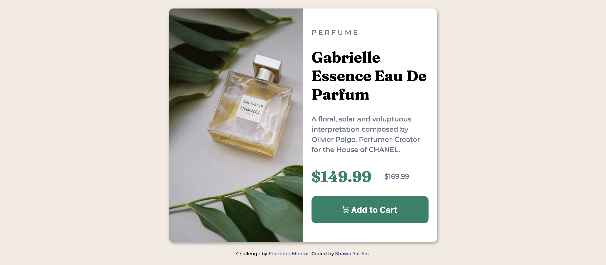

# Frontend Mentor - Product preview card component solution

This is a solution to the [Product preview card component challenge on Frontend Mentor](https://www.frontendmentor.io/challenges/product-preview-card-component-GO7UmttRfa). Frontend Mentor challenges help you improve your coding skills by building realistic projects. 

### The challenge

Users should be able to:

- View the optimal layout depending on their device's screen size
- See hover and focus states for interactive elements

### Screenshot

[Mobile](./screenshot-mobile.png)

## My process
- Define the div containers into three main sections: card, image, text.
- Define a div container for the price to use flexbox.
- Figure out layout in CSS.
- Style in CSS in mobile-first workflow.
- Implement responsive design for desktop.

### Built with

- Semantic HTML5 markup
- CSS custom properties
- Flexbox
- Mobile-first workflow

### What I learned

- Apply flexbox in a mobile-first workflow.
- Background image: cover to fully cover a container
- Practice layout in CSS
- An svg image can be put in a button!
